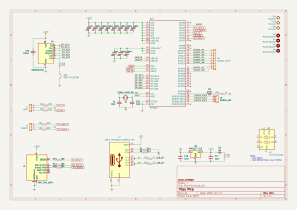

<h1>🐤 piko </h1>

  
  
  
  

  
 

CMSIS DAP Probe

### 🧺 Schematic

## Reference

- make new project Piko, picoprobe based on https://github.com/ErichStyger/mcuoneclipse/tree/master/KiCAD/Projects/PicoLink
- wagiminator ch552 daplink https://github.com/wagiminator/CH552-DAPLink
- yapicoprobe https://github.com/rgrr/yapicoprobe/blob/master/doc/hardware.adoc
- mcu on eclipse picolink https://mcuoneclipse.com/2023/04/08/open-source-picolink-raspberry-pi-rp2040-cmsis-dap-debug-probe/
